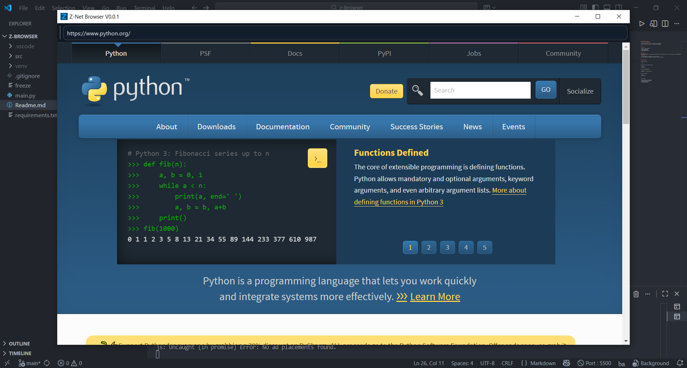
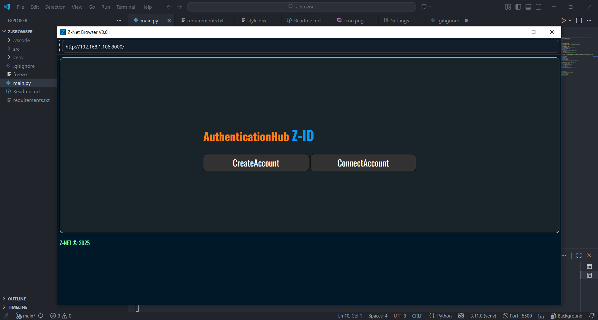
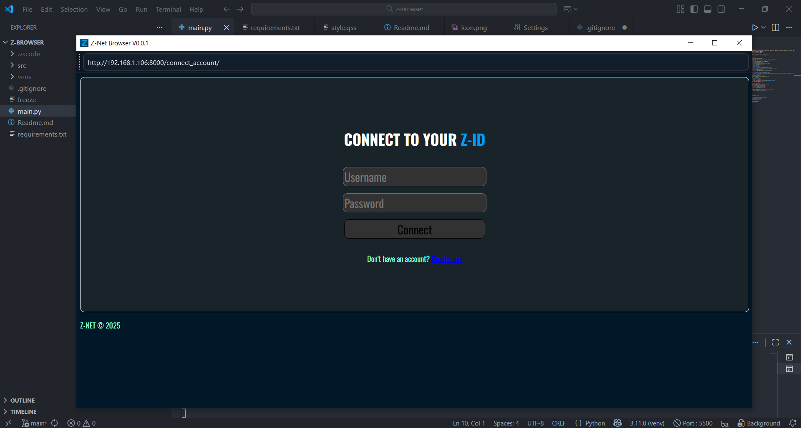
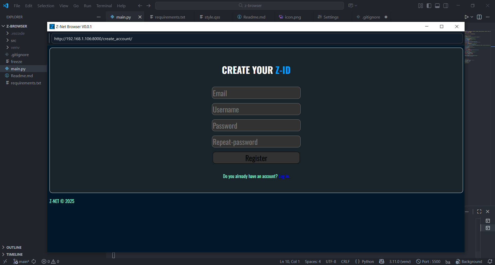
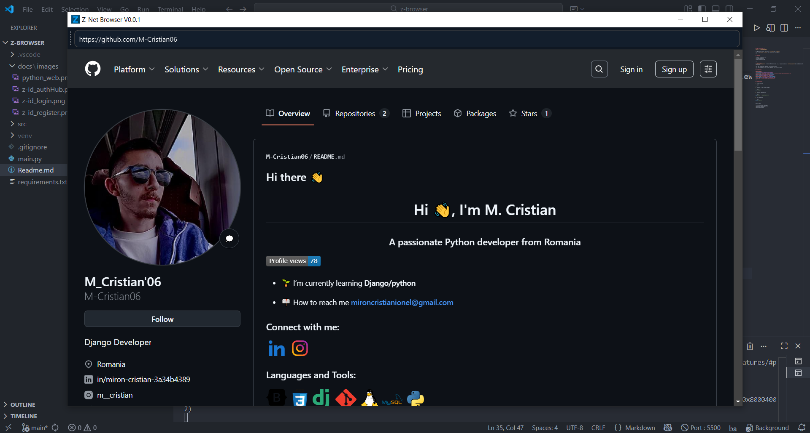

# Z-Browser V0.0.2
**part of Z-NET ECOSYSTEM**

A lightweight browser built with **Python** and **PyQt6**
This is an **alpha version** for testing and development.

---

## Features 

- Simple, clean interface
- Url bar navigation 
- Custom User-Agent
- Theme support via QSS

---
## Modules 

- **safe_module.py**
  
safe_module.py provides a **SafeWebPage** class for **PyQt6** that adds safer web browsing. It automatically    denies risky permissions like **Camera**, **Microphone**, and **Notifications**, and prompts the user for **LocalStorage** access.

- **tabs_module.py**
  
tabs_module.py provides a custom **QTabWidget** for **Z-Browser(PyQt6)** browser. It supports closable tabs, a **‘+’** tab for creating **new tabs**, dynamic tab titles from **webpage titles**, and integration with **SafeWebPage** to ensure safer browsing in each tab. 


---
## Limitations
- **FullScreenSupport** ❌ Native HTML5 fullscreen (e.g., YouTube videos) is **not available** due to QWebEngineView limitations.

- No tabs support yet (**fixed**)
- No back/forward/refresh buttons (planned for future versions)

---
## Screenshots
These images show different web pages rendered inside the Z-Browser engine.
### PYTHON-WEB

### Z-ID(Z-NET Ecosystem) Project[AuthHub]  -> https://github.com/M-Cristian06/Z-ID-

### Z-ID(Z-NET Ecosystem) Project[LoginPage] 

### Z-ID(Z-NET Ecosystem) Project[RegisterPage]

### GitHubProfile(M-Cristian06) -> https://github.com/M-Cristian06 


--- 

## Installations

1. Clone the repo:

```bash
git clone https://github.com/M-Cristian06/Z-Browser.git
```
2. Navigate to the project folder:

```bash
cd Z-Browser
```

3.  Install dependencies:

```bash
pip install -r requirements.txt
```

4. Run the browser 

```bash 
python main.py
```


## Future Plans 

- Fully functional tab support (**added** in V0.0.2)
- Back/Forward/refresh buttons 
- Bookmarks and history
- Fullscreen support

## License
This project is licensed under the MIT License.
See the LICENSE file for details.


## Requirements
- Python 3.10+
- PyQt6
- PyQt6-WebEngine
<<<<<<< HEAD


